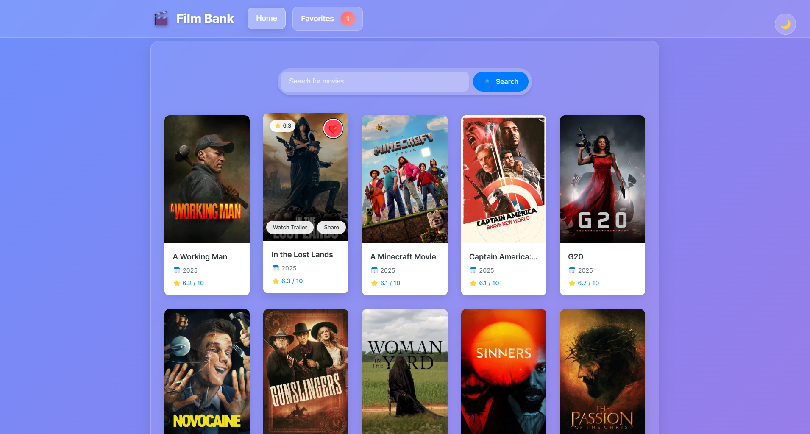
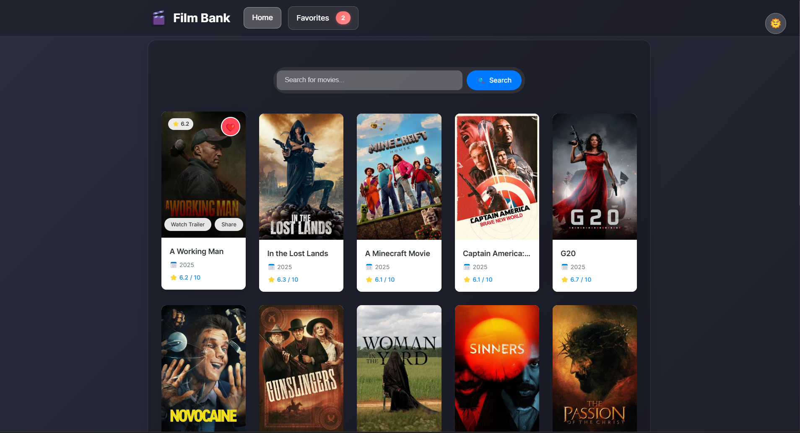

# 🎬 Film Bank - Movie Search Application

A modern, responsive React application that allows users to search and explore movies using TMDB API. Features a beautiful UI with dark/light mode support and real-time search capabilities.

## ✨ Features

- 🔍 Real-time movie search functionality
- 🌓 Dark/Light mode toggle
- 📱 Responsive design for all devices
- 🎯 Popular movies showcase
- ⚡ Fast and efficient search with debouncing
- 🎨 Beautiful UI with animated background shapes

## 🖼️ Screenshots


*Application in Light Mode - Showcasing the movie search interface*


*Application in Dark Mode - Featuring the elegant dark theme*

## 🚀 Getting Started

### Prerequisites

- Node.js (v14 or higher)
- npm
- TMDB API Key (Free)

### TMDB API Setup

1. Visit [TMDB Website](https://www.themoviedb.org/) and create a free account
2. After logging in, go to your profile settings
3. Click on the "API" section in the left sidebar
4. Request a new API key for a "Developer" account
5. Fill in the required application details
6. Once approved, copy your API key (v3 auth)

### API Configuration (Two Options)

#### Option 1: Using config file (Recommended)
1. Create a new file `src/config/apiConfig.js`:
```javascript
export const API_KEY = 'your_api_key_here';
export const BASE_URL = 'https://api.themoviedb.org/3';
```

#### Option 2: Direct API file modification
If you prefer, you can add the API key directly in `src/services/API.js`:
1. Open `src/services/API.js`
2. Uncomment and modify these lines at the top of the file:
```javascript
// const API_KEY = 'your_api_key_here';
// const BASE_URL = 'https://api.themoviedb.org/3';
```

### Installation

1. Clone the repository:
```bash
git clone [your-repository-url]
```

2. Navigate to the project directory:
```bash
cd film-bank-react-API
```

3. Install dependencies:
```bash
npm install
```

4. Create a `.env` file in the root directory and add your TMDB API key:
```env
REACT_APP_TMDB_API_KEY=your_api_key_here
```

### Running the Application

1. Start the development server:
```bash
npm run dev
```

2. Open your browser and visit:
```
http://localhost:5173
```

### Building for Production

To create a production build:
```bash
npm run build
```

## 🛠️ Built With

- React.js
- Vite - Next Generation Frontend Tooling
- React Router DOM
- TMDB API
- CSS3 with custom animations
- Context API for theme management

## 📝 Usage

- **Search Movies**: Type in the search bar to find movies in real-time
- **Toggle Theme**: Click the sun/moon icon to switch between light and dark modes
- **View Movie Details**: Click on any movie card to see more information
- **Browse Popular Movies**: The home page displays popular movies by default

## 🤝 Contributing

Contributions are welcome! Feel free to submit issues and pull requests.

1. Fork the repository
2. Create your feature branch (`git checkout -b feature/AmazingFeature`)
3. Commit your changes (`git commit -m 'Add some AmazingFeature'`)
4. Push to the branch (`git push origin feature/AmazingFeature`)
5. Open a Pull Request

## 📄 License

This project is licensed under the MIT License - see the [LICENSE](LICENSE) file for details.

## 👏 Acknowledgments

- [The Movie Database (TMDB)](https://www.themoviedb.org/) for providing a comprehensive, free API for movie data. This product uses the TMDB API but is not endorsed or certified by TMDB.
- Icons and emojis from [OpenMoji](https://openmoji.org/)

## 👨‍💻 Author

**Rezwanullah Quraishi**

- GitHub: [@Rezwanullah](https://github.com/rezwanqkhan)
- LinkedIn: [Rezwanullah Quraishi](https://www.linkedin.com/in/rezwanullah-quraishi-608314260/)

---
*Made with ❤️ by Rezwanullah Quraishi*
